# cloud_vision_saas Exercise
App Link: https://cloudvisionproject-347305.ue.r.appspot.com

## Creating GCP Cloud Project
Create a new project in Google cloud console.
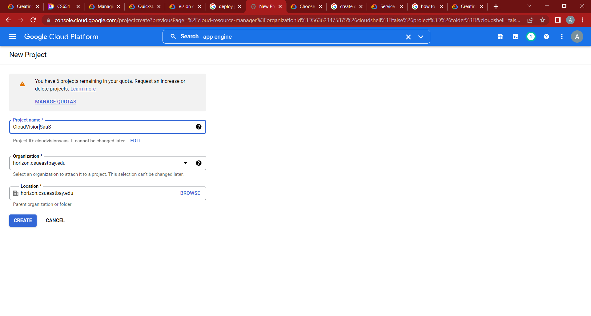
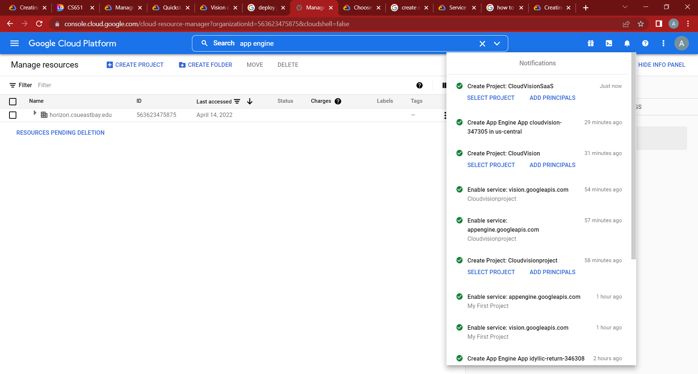
### Create An Application on GCP
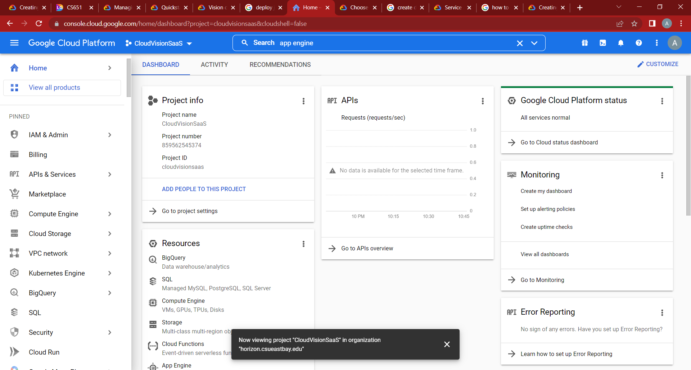
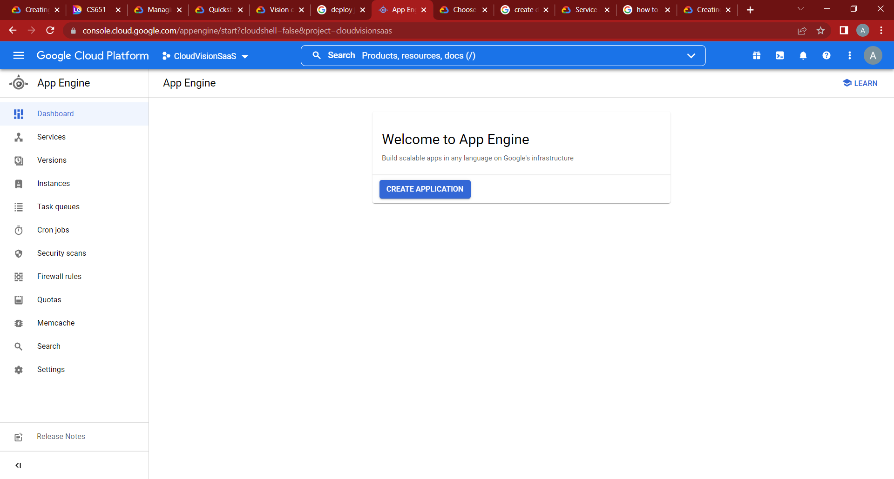
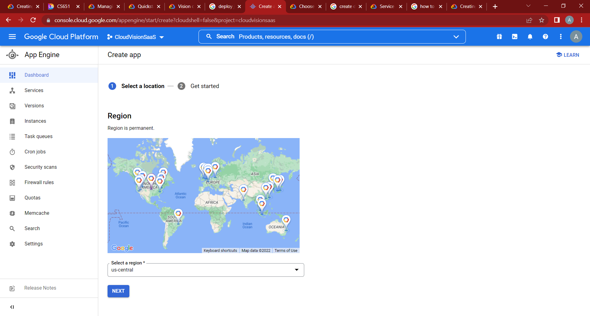
### Change Language to Java
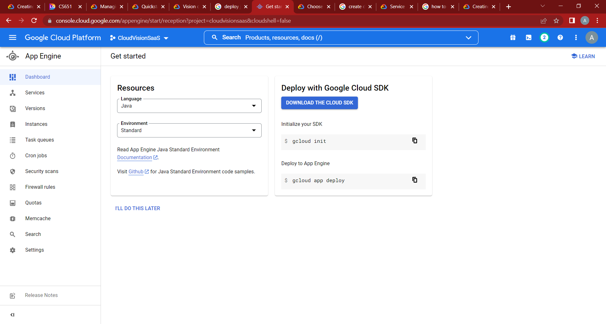
### Enable Cloud Vision API
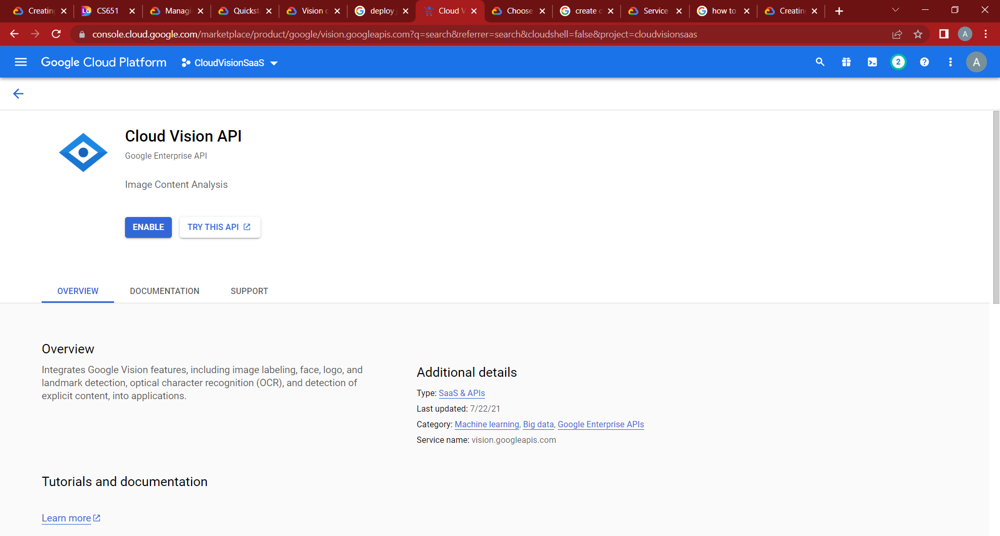

### Go to IAM & Admin and setup service account
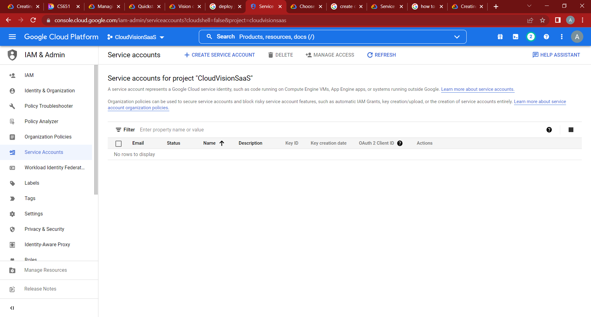
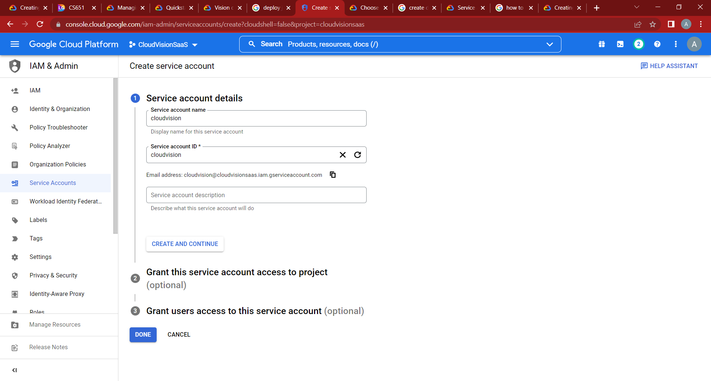
## Creating Eclipse Project
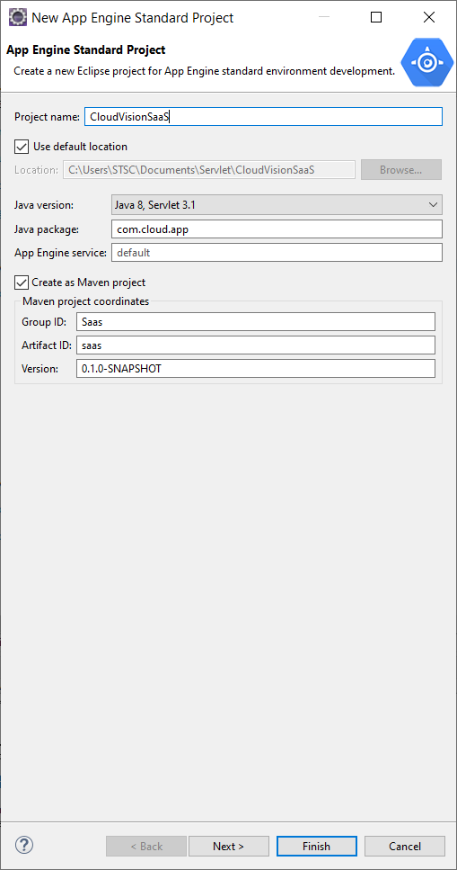
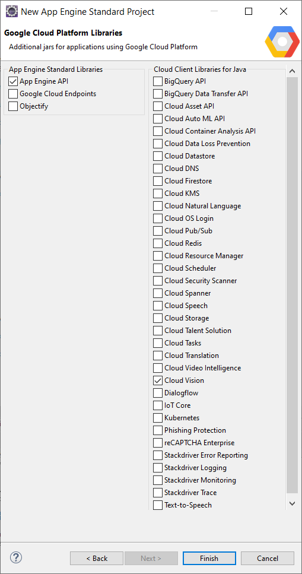

Create jsp application pages and corresponding servlets.
HelloAppEngine.java: The main application that handels Servlets doGet requests and responses.
Upload.java: The Upload.java servlet gets the requests.
index.jsp: Allows to upload image to the application. 
labels.jsp: Shows the result that is recieved from Google Cloud Vision

After creating app deploy your project to google cloud in the cloud project created.

## Deployed Application
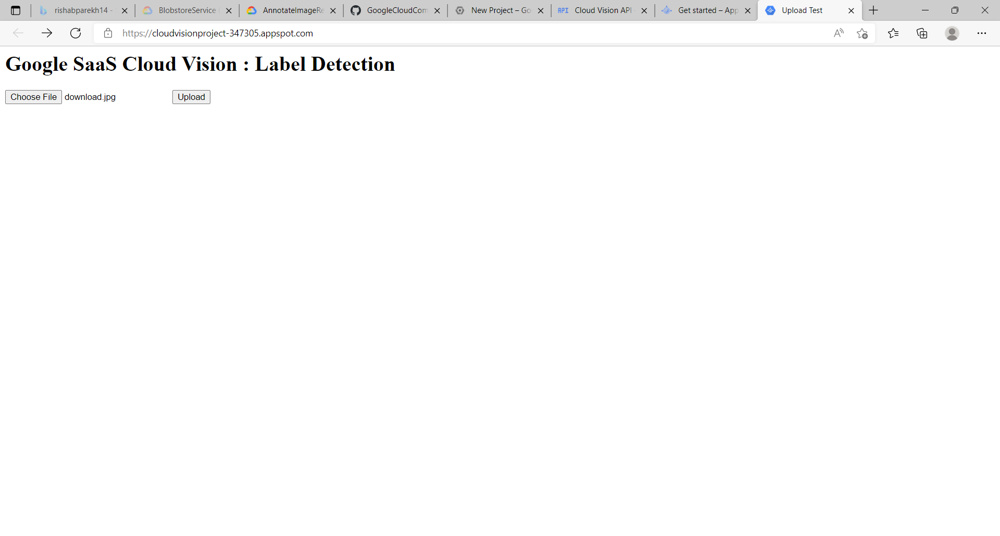
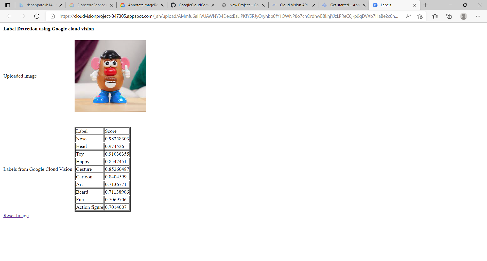

